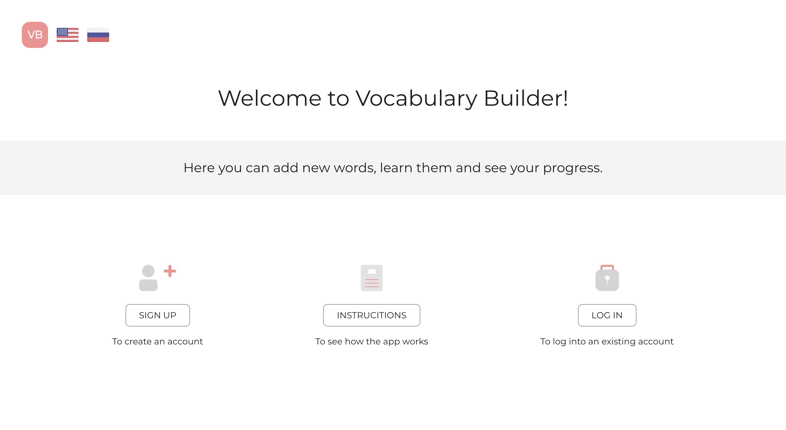

## Description:

#### Technologies and tools used:

- React
- Typescript
- Node.js
- Mongo DB
- Express.js
- Jest testing framework
- Testing library (React testing library)
- Sass
- Heroku

### App functionality overview:

The app allows to make a list of vocabulary, review the words, and track the progress, therefore memorizing foreign words faster.

To use the app:

- create an account
- add some words
- review them and learn by typing in translation
- track the progress

### Demo link

[Click to go to live demo](https://appvocabularybuilder.herokuapp.com/).

### Video demo: (click the image below to play)

#### What I learned:

Making this app I learned how to build a REST API and use Node.js as a backend for the React application.
It also helped me learn TypeScript. Overall, it was a good practice to learn new technologies and improve React skills

## How to get the app locally

- **`git clone https://github.com/AnyaSen/Vocabulary-app.git`**

- **`npm install`**

### Commands:

- to run locally: **`npm run dev`**
- to run tests: **`cd frontend`** + **`npm test`**
